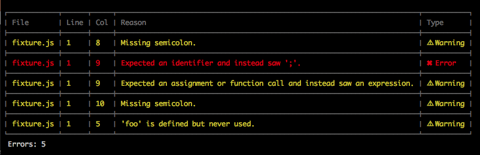

# cool-reporter

> Cool reporter for [JSHint](https://github.com/jshint/jshint)



## Install
```sh
$ npm install --save-dev cool-reporter
```

## Usage

### JSHint CLI

```sh
$ jshint --reporter node_modules/cool-reporter/reporter.js file.js
```

### [gulp-jshint](https://github.com/wearefractal/gulp-jshint)

```js
gulp.task('default', function () {
	gulp.src(['file.js'])
		.pipe(jshint('.jshintrc'))
		.pipe(jshint.reporter('cool-reporter'));
});
```

### [grunt-contrib-jshint](https://github.com/gruntjs/grunt-contrib-jshint)

```js
grunt.initConfig({
	jshint: {
		options: {
			reporter: require('cool-reporter')
		},
		target: ['file.js']
	}
});

grunt.loadNpmTasks('grunt-contrib-jshint');
grunt.registerTask('default', ['jshint']);
```
